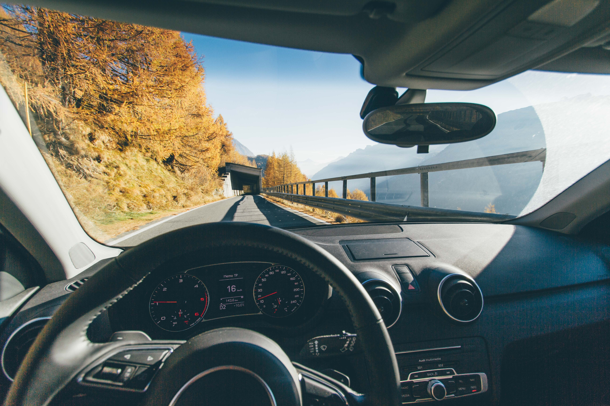

# Blog Post



The laundry list of tasks for self-driving cars is long. We expect them to monitor road conditions, keep an eye on optimal traffic flows, and make sure the car is climate controlled at all times.

One of the most crucial tasks a self-driving car must tackle is pedestrian detection - recognizing people in live video, and taking evasive action if needed.

> With his son's driver's test fast approaching, Chris Urmson claims that "My team are committed to making sure that doesn't happen." [TED](https://www.ted.com/talks/chris_urmson_how_a_driverless_car_sees_the_road
).

At Pachyderm, we build tools that help data scientists create repeatable
experiments. Part of how we do that is by breaking tasks into
composable subtasks.

In this set of posts, we'll build a pipeline capable of taking an ingesting a video stream and identifying people in the frames. This first post will tackle the first step: breaking an incoming video into frames for further analysis.

##Prerequisites

This guide assumes that you already have Pachyderm running locally. [Check out our Local Installation](http://docs.pachyderm.io/en/latest/getting_started/local_installation.html) instructions if haven’t done that yet and then come back here to continue.

##Setting Up the Pipeline

*You can view the full code at http://github.com/thekevinscott/videos.py*

Start by creating a Pachyderm repository:

```
pachctl create-repo videos
```

We name our repo `videos`. This is important - we'll refer to this later to
retrieve our exported frames. You can see all the repos in Pachyderm with:

```
pachctl list-repo
```

Next, download a sample video and add it to your repository with:

```
pachctl put-file videos master sample.mp4 -f https://sample-videos.com/video123/mp4/240/big_buck_bunny_240p_1mb.mp4
```

You can grab sample videos from https://sample-videos.com has. We call our video `sample.mp4`. When you add a file to Pachyderm, it's tagged with a specific commit. You can see all your commits with:

```
pachctl list-commit videos
```

To see the file you just added, specify the commit id:

```
pachctl list-file videos <COMMIT_ID>
```

The next step is to create a pipeline, so the video can be processed:

```
pachctl create-pipeline -f https://raw.githubusercontent.com/thekevinscott/videos.py/master/videos.json
```

This JSON file is our pipeline spec. Here's how it looks:


```
{
  "pipeline": {
    "name": "split-video"
  },
  "transform": {
    "cmd": [
        "python3",
        "/split-video-frames.py",
        "--source",
        "/pfs/videos/sample.mp4",
        "--target",
        "/pfs/out/written-images"
    ],
    "image": "videos"
  },
  "input": {
    "atom": {
      "repo": "thekevinscott/videos.py",
      "glob": "/*"
    }
  }
}
```

It defines a Python script, `split-video-frames.py`, that will split our video into frames, along with arguments for calling that script. If you'd like, you can clone the [repo locally](http://github.com/thekevinscott/videos.py) and invoke the script with:

```
python3 split-video-frames.py --source sample.mp4 --target ./out
```

Our pipeline hardcodes the input video - `sample.mp4` - along with the output folder. Pachyderm automatically provides two folders for us:

* `/pfs/videos`, which matches your repo name, contains any files you've imported with `pachyderm put-file`.
* `/pfs/out` contains all the output that your scripts write.

## Seeing the output

As soon as you created your pipeline, Pachyderm should start running. You can see the progress with:

```
pachctl list-pipeline
```

And you can see output from the script with:

```
pachctl get-logs video
```

Once the script has completed running, you can preview your frames with:

```
pachctl get-file split-video master written-images/1.jpg | open -f -a /Applications/Preview.app
pachctl get-file split-video master written-images/2.jpg | open -f -a /Applications/Preview.app
pachctl get-file split-video master written-images/3.jpg | open -f -a /Applications/Preview.app
```

## Next

Getting a pipeline set up in Pachyderm is super quick, and it's composable.

Our next installment will take our split frames, and detect whether there are people in a given frame.

Stay tuned!